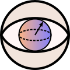

# QCVIS — Interactive Visualization of Quantum Algorithms

QCVIS is a web application for interactive visualization of quantum algorithms, with the goal of improving understanding of quantum algorithms when getting started with quantum computing.
Four different visualizations are provided at this time:

- A state bar plot showing a bar graph of probabilities with phase represented as a color
- A Q-sphere that maps each bit combination to a point on a sphere, with relative probabilities shown as lines of varying length and phase represented as a color
- An up to four-dimensional state cube (inspired by the visualizations in [Bettina Justs's “Quantencomputing Kompakt”](https://doi.org/10.1007/978-3-662-61889-9)) which shows the probability of each bit combination as the filled height of a cube and where phase is encoded as the fill color
- An up to four-dimensional hybrid state cube, where each bit combination is displayed as a phase disk

In addition, in-circuit phase disks provide visualization of individual qubits.
All state transitions are animated to improve the understandability of what the transition does.
The perceptually near-uniform color space [Oklab](https://bottosson.github.io/posts/oklab/) is used for all color bars.
Circuits can be edited interactively within the application and even be exported as [OpenQASM 2.0](https://github.com/openqasm/openqasm/tree/OpenQASM2.x), [Qiskit](https://qiskit.org/) [Python](https://www.python.org) code, or [QUIL](https://github.com/quil-lang/quil).

QCVIS was developed at the [Fraunhofer Institute for Computer Graphics Research IGD](https://www.igd.fraunhofer.de) by Leon Camus ([28Smiles](https://github.com/28Smiles)) and Paul Wagner ([pkwagner](https://github.com/pkwagner)) within the scope of an (advanced) visual computing practical lab at [TU Darmstadt](https://www.tu-darmstadt.de) supervised by Dr.-Ing. Johannes S. Mueller-Roemer ([fh-igd-mueller-roemer](https://github.com/fh-igd-mueller-roemer)) within the scope of the Center for Applied Quantum Computing (Zentrum für Angewandtes Quantencomputing ZAQC) funded by the state of Hessen.

## Building

To build QCVIS you first need to install

- [Node.js](https://nodejs.org/) (installation via [nvm](https://github.com/nvm-sh/nvm) or [nvm-windows](https://github.com/coreybutler/nvm-windows) recommended)
- [Yarn](https://yarnpkg.com/) (should work via `corepack enable`, if it doesn't, try `npm install -g yarn`)
- Optionally [Rust](https://www.rust-lang.org/) (installation via [rustup](https://rustup.rs/) recommended) if you want to build the [Tauri](https://tauri.app/) desktop application wrapper

Steps to build:

```sh
yarn install # install dependencies
yarn run dev # developer build with hot reload
yarn run build # optimized build for production
yarn run dev:tauri # developer build with Tauri-wrapper
yarn run build:tauri # optimized build with Tauri-wrapper
```

## License

QCVIS is provided here under the terms of the European Union Public Licence (EUPL) v. 1.2, see [`LICENSE.txt`](LICENSE.txt).
For alternate, non-copyleft licensing terms, please contact <andre.stork@igd.fraunhofer.de>.

### Logos

We provide the included QCVIS logo under the [CC BY-ND 4.0 license](https://creativecommons.org/licenses/by-nd/4.0/) (attribution, no derivatives).



The included [Qiskit](src/components/modal/QiskitLogo.svg) and [Quil](src/components/modal/QuilLogo.svg) logos retain their original copyrights and potential trademarks and are used under nominative fair use in the context of exporting files in the respective formats.

## Contributing

You must sign a Contribution License Agreement (CLA) granting Fraunhofer IGD sublicensable, perpetual, worldwide, non-exclusive, royalty-free, irrevocable copyright and patent licenses, before any non-trivial pull request will be merged.
This a one-time requirement for this project.
You do not have to do this up-front.
You can clone, fork, and submit your pull request as usual.
Please contact <andre.stork@igd.fraunhofer.de> for details.

## Third-party Dependencies and Attribution

A list of third-party dependencies and their licenses / attribution notices is provided in [`DEPENDENCIES.txt`](DEPENDENCIES.txt).
The Tauri desktop application wrapper has additional dependencies documented in [`src-tauri/DEPENDENCIES.txt`](src-tauri/DEPENDENCIES.txt).
